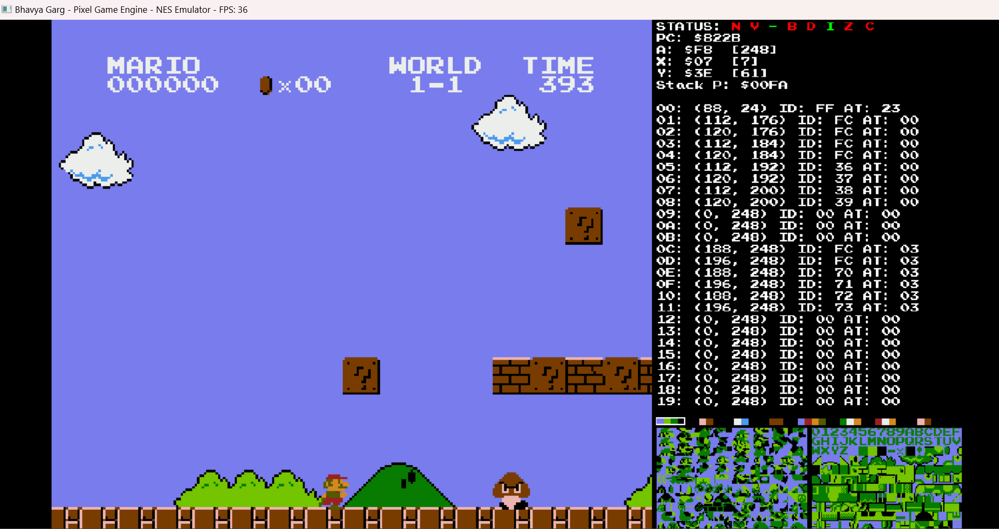
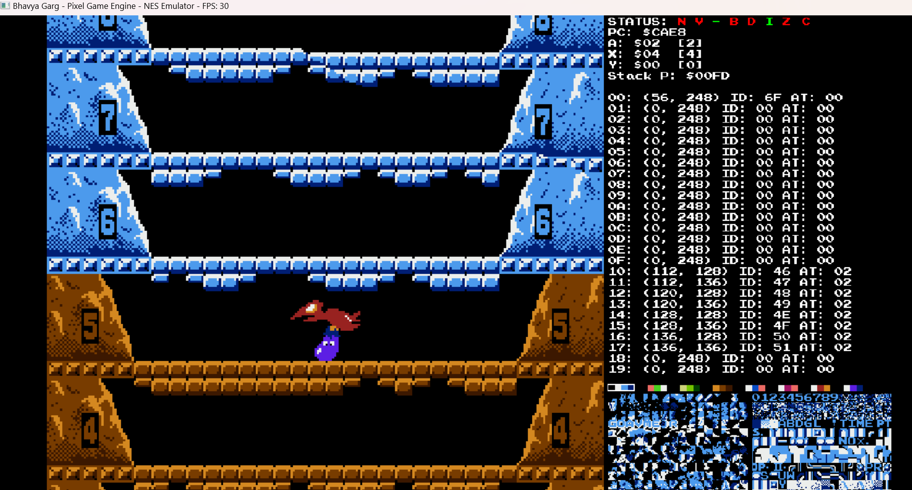
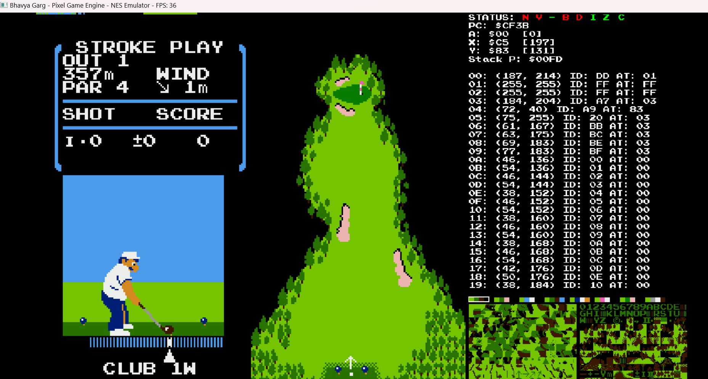

#NES Emulator
This is an emulator written in C++, which helps to play Nintendo games on PC.

##Features
You can select the game you play from ```./nesfiles```, by default ```super_mario_bros.nes``` is selected.
After clicking on run button in visual studio, you will be able to play the selected game.

##Pre-requistes
1. Visual Studio installed in your computer
2. Desktop development with C++ workload has to be installed.

##How to run
1. Clone this repo into a folder at your local using ```git clone https://github.com/bhavyagrg/NESemulator.git```
2. Have pre-requistes ready.
3. Inside ```src\Application.cpp```, change the file name here ```std::make_shared<Cartridge>("./nesfiles/donkey_kong.nes");```, replace ```donkey_kong.nes``` with your desired nes file from ```./nesfiles```.
4. Click on run button to run your game.

##Output Screens for some games
1. Super Mario Bros
   

2. Ice Climber
   
   
4. Golf
   

   and many more...
 
